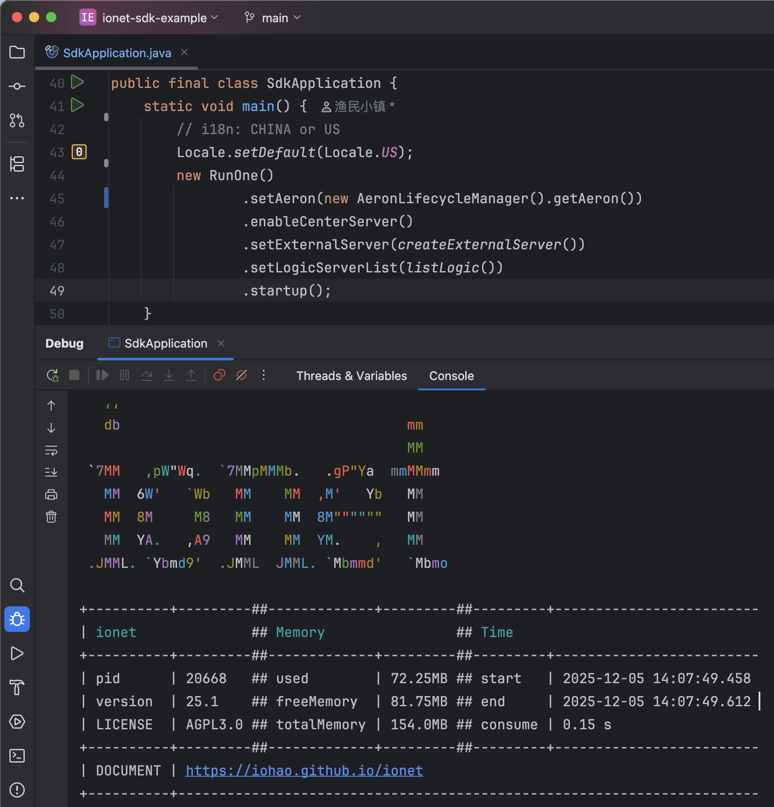

## 介绍

**语言**: [English](README.md) | 中文


代码生成文档：https://iohao.github.io/game/docs/examples/code_generate


该项目是与 ionet SDK（C# Sdk、Ts Sdk） 相关的联调演示，服务器提供了 `action、广播、错误码` 等相关内容用于交互演示。


**该项目主要演示 3 个方面的功能**

1. 与各种前端 SDK 的联调交互：`action、广播、错误码`，并展示了[协议碎片](https://iohao.github.io/ionet/docs/manual_high/protocol_fragment)及 List 的数据传输支持。
2. 心跳的处理。
3. 各 SDK 的对接代码生成： `action、广播、错误码` 交互代码生成。


**SDK 代码生成的几个优势**

1. 帮助客户端开发者减少巨大的工作量，**不需要编写大量的模板代码**。
2. **语义明确，清晰**。生成的交互代码即能明确所需要的参数类型，又能明确服务器是否会有返回值。这些会在生成接口时就提前明确好。
3. 由于我们可以做到明确交互接口，进而可以明确参数类型。这使得**接口方法参数类型安全、明确**，从而有效避免安全隐患，从而**减少联调时的低级错误**。
4. 减少服务器与客户端双方对接时的沟通成本，代码即文档。生成的联调代码中有文档与使用示例，方法上的示例会教你如何使用，即使是新手也能做到**零学习成本**。
5. 帮助客户端开发者屏蔽与服务器交互部分，**将更多的精力放在真正的业务上**。
6. 为双方联调减少心智负担。联调代码使用简单，**与本地方法调用一般丝滑**。
7. 抛弃传统面向协议对接的方式，转而使用**面向接口方法的对接方式**。
8. 当我们的 java 代码编写完成后，我们的文档及交互接口可做到同步更新，不需要额外花时间去维护对接文档及其内容。


## 启动服务器

> 运行 SdkApplication.java 启动游戏服务器




## 生成代码

运行 GenerateTest 后

1. 将会在 ./target/code 目录中生成与前端交互的文件。
2. 将会在 ./target/proto 目录中生成 .proto 文件。


## SDK 代码生成的使用场景

根据服务器所提供的 `action、广播、错误码`，自动生成前端客户端所需要的交互代码。目前提供了多种语言的支持，分别是 C#、TypeScript、GDScript，其语言对应的游戏引擎有

| SDK            | 支持的游戏引擎            |
|----------------|--------------------|
| C# SDK         | Godot、Unity        |
| TypeScript SDK | Cocos Creator、Laya |
| GDScript SDK   | Godot              |


TypeScript SDK 除了能用在游戏引擎外，还能用在各种现代的前端框架，如 React、Vue、Angular 等。 简单的说，TypeScript SDK 适用于任意支持 TypeScript 的相关项目。同样，C# SDK 适用于任意支持 C# 的相关项目。

假如现在你的服务器项目已经提供了数百个 action 方法，而前端引擎需要由 TypeScript 切换到 C# 语言相关的引擎。 那么 框架的代码生成将会派上巨大的用场，因为可以瞬间生成与前端交互所需的代码。 这个操作将为前端节省巨大的工作量，同时也为沟通节省了巨大的成本。 生成的交互 api 是直观的，如本地方法调用般丝滑。

换句话说，你可以将你的 ionet 项目带到下个新项目中使用（或者新公司的项目）， 无论新项目前端使用的是 TypeScript 游戏引擎还是 C# 游戏引擎，都能为前端生成交互代码。

此外，除了切换前端引擎的场景外，还支持同时与不同的游戏引擎交互，因为无论生成哪种语言的交互 api，在使用的感观上几乎是一致的。

> 其他案例：当我们在开发个人项目时，在没能找到前端可合作的开发者时，依然可以先编写游戏服务器相关的代码，将来如果遇见合适的合作人员时，就可以通过代码生成将已有的 action 生成一份给到前端哥们。


## 前端示例项目

以下这些 demo 已经与本项目调通，前端代码 **action、广播、错误码**等，由框架生成。 前端开发者在通信的交互上本地方法调用一般丝滑，让前端开发者将更多的精力放在真正的业务，而不是编写这些模板式的交互代码上。

| Github                                                                            | 语言         | 描述                                                                                |
|-----------------------------------------------------------------------------------|------------|-----------------------------------------------------------------------------------|
| [SdkGDScriptExampleGodot](https://github.com/iohao/ioGameSdkGDScriptExampleGodot) | GDScript   | 与 Godot 互通的一个示例。 Godot、Protobuf、Netty、ionet、GDScript、WebSocket                    |
| [SdkC#ExampleGodot](https://github.com/iohao/ioGameSdkCsharpExampleGodot)         | C#         | 与 Godot 互通的一个示例。 Godot、Protobuf、Netty、ionet、C#、Csharp、WebSocket                   |
| [SdkC#ExampleUnity](https://github.com/iohao/ioGameSdkCsharpExampleUnity)         | C#         | 与 Unity 互通的一个示例。 Unity、Protobuf、Netty、ionet、C#、Csharp、WebSocket                   |
| [SdkTsExampleCocos](https://github.com/iohao/ioGameSdkTsExampleCocos)             | TypeScript | 与 Cocos Creator 互通的一个示例。 CocosCreator、Protobuf、Netty、ionet、TypeScript、WebSocket   |
| [SdkTsExampleVue](https://github.com/iohao/ioGameSdkTsExampleVue)                 | TypeScript | 与 Vue 互通的一个示例。 Vue、Protobuf、Netty、ionet、TypeScript、WebSocket                      |
| [SdkTsExampleAngular](https://github.com/iohao/ioGameSdkTsExampleAngular)         | TypeScript | 与 Angular 互通的一个示例。 Angular、Protobuf、Netty、ionet、TypeScript、WebSocket              |
| [SdkTsExampleHtml](https://github.com/iohao/ioGameSdkTsExampleHtml)               | TypeScript | 与 webpack 互通的一个示例。 （webpack: html + ts）、Protobuf、Netty、ionet、TypeScript、WebSocket |


## 一次编写，到处对接；提升巨大的生产力；

框架能为各种前端生成 `action、广播、错误码` 相关代码。这将意味着，你只需要编写一次业务代码，就可以同时与这些游戏引擎或现代化的前端框架交互。


**一次编写**指的是编写一次 java 业务代码，而**到处对接**则是指为不同的前端项目生成与服务器交互的代码。


### Action Java Code

让我们先看一段 java 代码，这段代码我们只需要关注类上的注释及 action 方法上的注释。


我们为 action 方法提供了一些描述，分别是

1. 方法描述
2. 参数的描述
3. 返回值的描述


### 生成的 TypeScript 代码，演示说明

根据 MyAction.java 生成 Ts 对应的代码如下

1. 生成了方法描述
2. 生成了方法参数类型及其描述
3. 生成了方法返回值类型及其描述
4. 更重要的是生成了相关的使用示例，方法上的示例会教你如何使用，即使是新手也能做到零学习本。


框架会为每个 action 生成两种编码风格的方法，分别是

1. code style: callback 回调风格，方法名以 of 打头。**优点：简洁，一体化**。
2. code style: async await，方法名以 ofAwait 打头。**优点：可避免回调地狱**。


**两种风格该如何选择？**

两个编码风格在本质上没有太大差别，简单业务选择 callback、复杂业务建议使用 async await。这里的复杂指的是你需要在回调中继续请求游戏服务器，这样就可能产生回调地狱，而 async await 编码风格可以很好的避免此问题。


**code style: callback** 

图中是 `code style: callback. 编码风格：回调风格`的演示，**优点：简洁，一体化**。

> hello action


> loginVerify action


**code style: async await** 

下图是 `code style: async await. 编码风格：async await 风格`的演示，**优点：可避免回调地狱**。

> **注意**看方法中的使用示例，框架会根据不同编码风格生成对应的使用示例。


> hello action


> loginVerify action


### 生成的 C# 代码，演示说明

根据 MyAction.java 生成 C# 对应的代码如下

1. 生成了方法描述
2. 生成了方法参数类型及其描述
3. 生成了方法返回值类型及其描述
4. 更重要的是生成了相关的使用示例，方法上的示例会教你如何使用，即使是新手也能做到零学习本。


框架会为每个 action 生成两种编码风格的方法，分别是

1. code style: callback 回调风格，方法名以 Of 打头。**优点：简洁，一体化**。
2. code style: async await，方法名以 OfAwait 打头。**优点：可避免回调地狱**。


**两种风格该如何选择？**

两个编码风格在本质上没有太大差别，简单业务选择 callback、复杂业务建议使用 async await。这里的复杂指的是你需要在回调中继续请求游戏服务器，这样就可能产生回调地狱，而 async await 编码风格可以很好的避免此问题。


**code style: callback** 

图中是 `code style: callback. 编码风格：回调风格`的演示，**优点：简洁，一体化**。

> hello action


> loginVerify action


**code style: async await** 

下图是 `code style: async await. 编码风格：async await 风格`的演示，**优点：可避免回调地狱**。

> 注意看方法中的使用示例，框架会根据不同编码风格生成对应的使用示例。

> hello action


> loginVerify action


### 小结

现在我们知道了一次编写，到处对接的威力了。我们只需要编写一份 java 代码就能生成各客户端的对接交互代码，为前端开发者减少了巨大的工作量，生成的交互 api 是直观的，如本地方法调用般丝滑。


代码生成可以让开发者专注于业务逻辑，而不是文档编写。它也可以提高团队协作的效率和质量，保证文档的同步和准确。如果没有游戏文档的生成，那么你将要抽出一些时间来编写、维护对接文档的工作，而且当团队人数多了之后，文档就会很乱、不同步、不是最新的、忘记更新等情况就会出现。


框架让我们做到了 java 方法注释即文档，action 代码即对接。当你的代码编写完后，对应的文档及交互代码也就完成了。这样就不需要额外的花时间去编写和维护文档了，可以节省更多的时间。


框架会为每个 action 生成两种编码风格的方法，分别是

1. code style: callback 回调风格，方法名以 of 打头。**优点：简洁，一体化**。
2. code style: async await，方法名以 ofAwait 打头。**优点：可避免回调地狱**。


## 如何生成 SDK 交互代码


关于代码生成，可阅读 `GenerateTest.java`


框架生成各 SDK 的交互代码是简单，通常有以下几个步骤

1. 加载需要生成代码的游戏逻辑服（业务逻辑服），用于生成 xxxAction。
2. 添加需要生成的交互语言 `generateCocosXXX`
3. 添加错误码：`addErrorCodeClass`，用于生成错误码
4. 生成 .proto 协议：`generateProtoFile`，用于生成 .proto 文件。


现在，我们只需要关注 `generateCodeXXX` 开头的方法；虽然下面的代码中给出了多个 `generateCodeXXX` 的代码生成，但在实现开发中，我们通常只需要生成其中一种，其交互代码默认将会生成到当前项目的  `target/code` 目录中。


目前我们只提供了 TypeScript、C#、GDScript 的生成实现

| Class                      | 描述                 |
|----------------------------|--------------------|
| GDScriptDocumentGenerate   | 用于生成 GDScript 代码   |
| CSharpDocumentGenerate     | 用于生成 C# 代码         |
| TypeScriptDocumentGenerate | 用于生成 TypeScript 代码 |


> 下一小节会对每一个 `generateCodeXXX` 做详细的说明。

```java
public final class GenerateTest {
    // setting root path
    static String rootPath = "/Users/join/gitme/test-sdk/";

    static void main() {
        // i18n: CHINA or US
        Locale.setDefault(Locale.US);
        CoreGlobalConfig.setting.parseDoc = true;

        /*
         * ExternalServer accessAuthentication
         * cn: 对外服访问权限，不生成权限控制的 action
         */
        SdkApplication.extractedAccess();
        DocumentAccessAuthentication reject = ExternalGlobalConfig.accessAuthenticationHook::reject;
        DocumentHelper.setDocumentAccessAuthentication(reject);

        // Load the business framework of each gameLogicServer
        // cn: 加载游戏逻辑服的业务框架
        SdkApplication.listLogic().forEach(logicServer -> {
            var builder = BarSkeleton.builder();
            logicServer.settingBarSkeletonBuilder(builder);
            builder.build();
        });

        /*
         * Generate actions, broadcasts, and error codes.
         * cn: 生成 action、广播、错误码
         */

        // ----- About generating TypeScript code -----
//        generateCodeVue();
//        generateCodeAngular();
//        generateCodeHtml();
//        generateCocosCreator();
//
        // ----- About generating C# code -----
//        generateCodeCsharpGodot();
//        generateCodeCsharpUnity();

        // ----- About generating GDScript code -----
        generateCodeGDScriptGodot();

        // Added an enumeration error code class to generate error code related information
        DocumentHelper.addErrorCodeClass(ErrorCode.class);
        // Generate document
        DocumentHelper.generateDocument();

        // Generate .proto
        generateProtoFile();
    }

    static void generateProtoFile() {
        /*
         * .proto generate
         * document https://iohao.github.io/game/docs/extension_module/jprotobuf
         */

        // By default, it will be generated in the target/proto directory
        // .proto 默认生成的目录为 target/proto

        // The package name to be scanned
        String packagePath = "com.iohao.example.sdk.data";
        GenerateFileKit.generate(packagePath);
    }
}
```


### Generate TypeScript

generateCodeVue()、generateCocosCreator() 都是通过 TypeScriptDocumentGenerate 类生成的。

> 下面是关于生成 TypeScript 语言的代码，分别生成了 Vue、CocosCreator 项目所需的交互代码。


```java
public final class GenerateTest {
    String rootPath = "/Users/join/gitme/example-sdk/";
    
    static void main() {
        ... 
        /*
         * Generate actions, broadcasts, and error codes.
         * cn: 生成 action、广播、错误码
         */
        
        // About generating TypeScript code
        generateCodeVue();
        generateCocosCreator();        
        ...
    }
    
    private static void generateCodeVue() {
        var documentGenerate = new TypeScriptDocumentGenerate();

        // 设置代码生成所存放的路径，如果不做任何设置，将会生成在 target/code 目录中
        // By default, it will be generated in the target/code directory
        String path = rootPath + "ioGameSdkTsExampleVue/src/assets/gen/code";
        documentGenerate.setPath(path);

        DocumentHelper.addDocumentGenerate(documentGenerate);
    }

    private static void generateCocosCreator() {
        var documentGenerate = new TypeScriptDocumentGenerate();

        // 设置代码生成所存放的路径，如果不做任何设置，将会生成在 target/code 目录中
        // By default, it will be generated in the target/code directory
        String path = rootPath + "ioGameSdkTsExampleCocos/assets/scripts/gen/code";
        documentGenerate.setPath(path);

        DocumentHelper.addDocumentGenerate(documentGenerate);
    }
}
```


### Generate C#

generateCodeCsharpUnity()、generateCodeCsharpGodot() 都是通过 CsharpDocumentGenerate 类生成的。

> 下面是关于生成 C# 语言的代码，分别生成了 Unity、Godot 项目所需的交互代码。


以下示例中，Unity 与 Godot 在代码生成的使用上是一样的。


```java
public final class GenerateTest {
    String rootPath = "/Users/join/gitme/example-sdk/";
    
    static void main() {
        ... 
        /*
         * Generate actions, broadcasts, and error codes.
         * cn: 生成 action、广播、错误码
         */
        
        // ----- About generating C# code -----
        generateCodeCsharpUnity();
        generateCodeCsharpGodot(); 
        ...
    }
    
    private static void generateCodeCsharpUnity() {
        var documentGenerate = new CsharpDocumentGenerate();
        // 设置代码生成所存放的路径，如果不做任何设置，将会生成在 target/code 目录中
        // By default, it will be generated in the target/code directory
        String path = rootPath + "SdkCsharpExampleUnity/Assets/Scripts/Gen/Code";
        documentGenerate.setPath(path);

        DocumentHelper.addDocumentGenerate(documentGenerate);
    }

    private static void generateCodeCsharpGodot() {
        var documentGenerate = new CsharpDocumentGenerate();
        // 设置代码生成所存放的路径，如果不做任何设置，将会生成在 target/code 目录中
        // By default, it will be generated in the target/code directory
        String path = rootPath + "SdkCsharpExampleGodot/script/gen/code";
        documentGenerate.setPath(path);

        DocumentHelper.addDocumentGenerate(documentGenerate);
    }
}
```


### 广播代码

TypeScript、C# 生成广播相关的代码文件统一命名为 `Listener`，如 `Listener.cs、Listener.ts`。Listener 文件中包含了服务器所有主动的广播动作，通常来说我们只需要在广播监听回调中编写自己的业务逻辑即可，如下


**C#**

```c#
Listener.ListenBulletBroadcast(result =>
{
    var bulletMessage = result.GetValue<BulletMessage>();
    result.Log(bulletMessage);
});

// This method adds print behavior for all broadcast listeners, aiming to inform developers which broadcast methods haven't been handled.
// cn: 该方法为所有广播监听添加了打印的行为，目的是让开发者知道有哪些广播方法没有处理
Listener.Listener_all();
```


**Typescript**

```typescript
Listener.listenBulletBroadcast(result => {
    const bullet = result.getValue(BulletMessageSchema);
    result.log(bullet);
})

// This method adds print behavior for all broadcast listeners, aiming to inform developers which broadcast methods haven't been handled.
// cn: 该方法为所有广播监听添加了打印的行为，目的是让开发者知道有哪些广播方法没有处理
Listener.listener_all();
```


### 错误码

错误码相关的代码文件统一命名为 `GameCode`，在触发错误时，服务器会将错误码放到 result responseStatus 字段中。


以下展示了两种编码风格关于错误的处理

```c#
public static async Task OnTestError()
{    
    var value = _testErrorValue++;
    Log("------- OnTestError ------");

    // code style: callback.
    SdkAction.OfTestError(value, result =>
    {
        result.Log(result.GetInt());
    }).OnError(result =>
    {
        // error
        result.Log(result.GetErrorInfo());
        // result.GetResponseStatus()
    });

    // code style: await promise.
    var result = await SdkAction.OfAwaitTestError(value);
    // result.GetResponseStatus()
    if (result.Success())
        result.Log(result.GetInt());
    else
        result.Log(result.GetErrorInfo());
}
```


## 注意事项

默认情况下，生成的 action 交互代码的方法名使用的是 java action 的方法名。如果你的 java action 方法名有变动，则会影响客户端的代码。


为了避免此类情况，有两种方式

1. 不要更改已经发布的 action 方法名。
2. 给 action 添加 `DocumentMethod` 注解来固定方法名。框架在生成对接代码时，会优先使用 `DocumentMethod` 注解的值。

```java
@ActionController(SdkCmd.cmd)
public final class SdkAction {    
    @ActionMethod(SdkCmd.loginVerify)
    @DocumentMethod("loginVerifyName")
    public UserMessage loginVerify(LoginVerifyMessage verifyMessage) {
        ...
    }
}
```


通常情况下，如果你没有频繁修改 action 方法名的习惯，可以省略 DocumentMethod 注解的使用，这样能使代码更加简洁。 但无论如何你都要记住，不要更改已经发布的方法名，否则可能让前端开发者产生不必要的小情绪。

